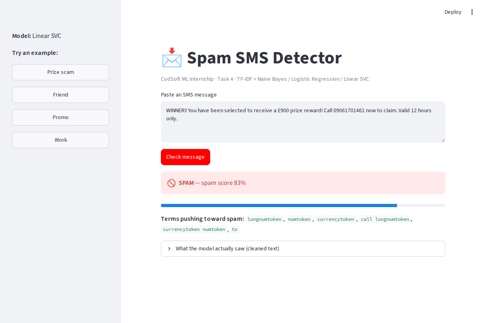
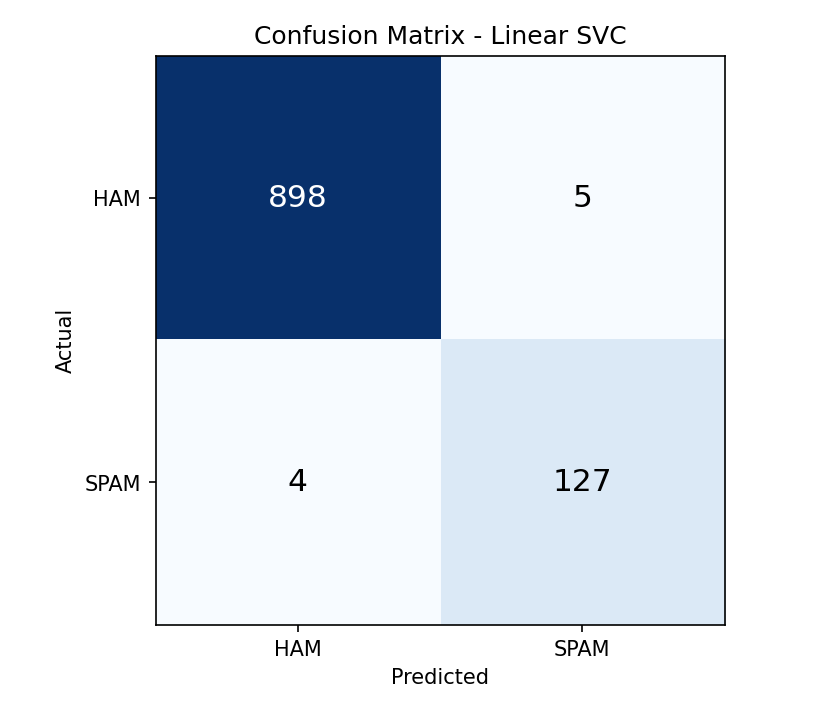

# Spam SMS Detection

**CodSoft Machine Learning Internship — Task 4**

An SMS spam classifier built on the SMS Spam Collection Dataset. The script cleans
the raw messages, converts them to TF-IDF features, compares three classifiers with
5-fold cross-validation, saves the best one, and a Streamlit app lets you test it on
any message.



🎥 **Demo video:** _add your LinkedIn post link here_

---

## Results

Test set: 1,034 messages (903 ham / 131 spam), never seen during training or model selection.
All metrics are for the **SPAM** class.

| Model | CV F1 (5-fold, train) | Accuracy | Precision | Recall | F1 |
|---|---|---|---|---|---|
| Multinomial Naive Bayes | 0.954 ± 0.009 | 0.992 | 0.984 | 0.954 | 0.969 |
| Logistic Regression | 0.951 ± 0.015 | 0.989 | 0.955 | 0.962 | 0.958 |
| **Linear SVC** ✅ | **0.956 ± 0.013** | **0.991** | **0.962** | **0.970** | **0.966** |

Linear SVC wins on cross-validated F1. On the test set it catches **127 of 131** spam
messages and wrongly flags only **5 of 903** legitimate ones.



### What made the difference

The first version deleted every digit and removed English stop words. That scored
F1 = 0.939. Two changes lifted it to 0.966 and cut total errors from 17 to 9:

1. **Numbers become tokens instead of disappearing.** Phone numbers, short codes, prize
   amounts, `£` and URLs are the strongest spam signals in this dataset. They're now
   replaced with `longnumtoken`, `numtoken`, `currencytoken` and `urltoken`. The top
   5 spam indicators the model learned are all these tokens.
2. **No stop-word removal.** scikit-learn's English stop list contains `call`, `now`,
   `please` and `get`, which are exactly the words spam is written in.

---

## Dataset

The dataset is **not** included in this repository (it's listed in `.gitignore`).

**Kaggle:** https://www.kaggle.com/datasets/uciml/sms-spam-collection-dataset

1. Download and unzip it to get `spam.csv`.
2. Put `spam.csv` in the same folder as `spam_sms_detection.py`.

```
CODSOFT_TASK4/
├── spam_sms_detection.py   # training pipeline
├── app.py                  # Streamlit web app
├── requirements.txt
├── confusion_matrix.png
├── assets/app_demo.png
└── spam.csv                # <- you add this
```

5,572 messages labelled `ham` / `spam` (5,169 after removing duplicates, ~87% ham).
The file is **latin-1** encoded and has three mostly empty `Unnamed:` columns. The script handles both.

---

## Run it

```bash
pip install -r requirements.txt

python spam_sms_detection.py     # trains, evaluates, writes spam_model.joblib (~5 s, CPU only)
streamlit run app.py             # opens the web app at http://localhost:8501
```

---

## Pipeline

| Step | Detail |
|------|--------|
| **Load** | `spam.csv` with latin-1 encoding, first two columns → `label` / `message`, drop NA + duplicates |
| **Clean** | Lowercase; URLs → `urltoken`, emails → `emailtoken`, `£ $ €` → `currencytoken`, 5+ digit numbers → `longnumtoken`, other numbers → `numtoken`; strip punctuation |
| **Split** | 80 / 20, stratified, `random_state=42` |
| **Vectorize** | `TfidfVectorizer(ngram_range=(1,2), min_df=2, sublinear_tf=True)`, fitted on the training set only |
| **Models** | Multinomial NB (`alpha=0.1`), Logistic Regression and Linear SVC (both `class_weight="balanced"`) |
| **Select** | 5-fold stratified CV F1 on the training set. Each fold re-fits its own vectorizer inside a `Pipeline`, so there's no leakage |
| **Evaluate** | Accuracy, precision, recall, F1, `classification_report` and confusion matrix on the held-out test set |
| **Save** | Model + vectorizer bundled in `spam_model.joblib` |
| **Explain** | Prints the top 15 terms pushing a message toward spam |

### Why F1 and not accuracy?

About 87% of the messages are ham. A model that always answers "ham" gets 87% accuracy
and catches zero spam. F1 balances precision (how many flagged messages really were spam)
and recall (how much of the real spam was caught).

### Why pick the model with CV instead of the test set?

If you choose the winner by test score, the test set stops being unseen. It becomes part
of training by selection. Cross-validation on the training data picks the model, and
the test set is used once for the final report.

---

## Using the saved model in code

```python
import joblib
from spam_sms_detection import clean_text

bundle = joblib.load("spam_model.joblib")
model, vectorizer = bundle["model"], bundle["vectorizer"]

msg = "Congratulations! You've won a free cruise. Call 09061701461 now!"
print("SPAM" if model.predict(vectorizer.transform([clean_text(msg)]))[0] else "HAM")
```

Always load the model and vectorizer together. The model's weights are indexed by that exact vocabulary.

---

## Troubleshooting

- **`Could not find 'spam.csv'`**: the file isn't next to the script, or it's still inside the zip.
- **`spam_model.joblib not found`** in the app: run `python spam_sms_detection.py` first.
- **`UnicodeDecodeError`**: the dataset must be read with `encoding="latin-1"`.
- **`ModuleNotFoundError`**: run `pip install -r requirements.txt` inside your active virtual environment.
